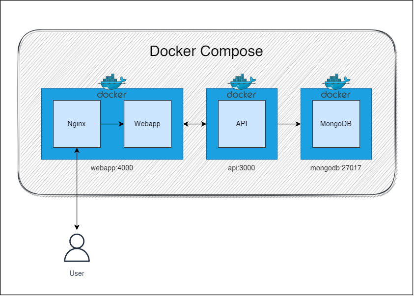
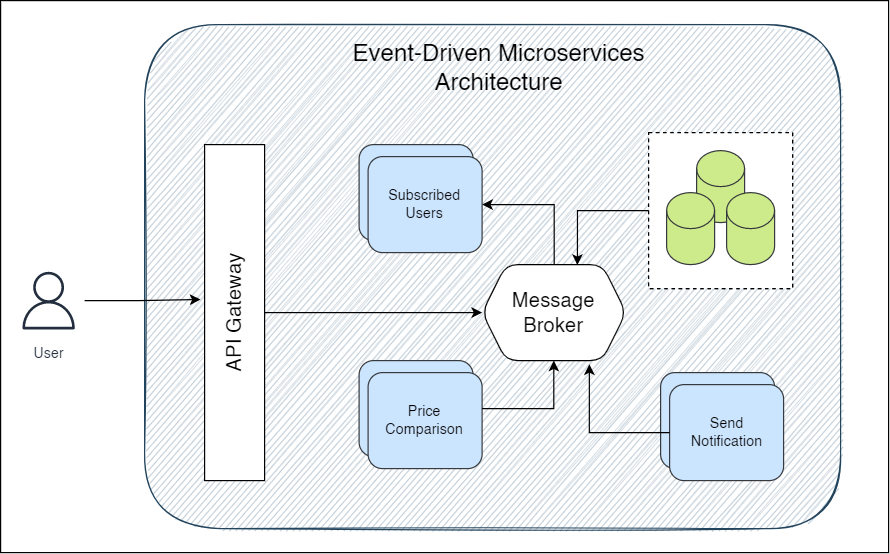

# Demo Price Alert App
This app is made for a demo purpose with the working functionality of users getting notified on price drop of subscribed products.

#### Task:
*Consider an ecommerce store that wants to give customers the ability to provide their email address on a product page and be notified via email when that product drops in price by a dollar or more.*

## Architecture
This App has been built using MERN Stack with the 2 main components of the App being API & Webapp.

Docker has been used to containerize the following services:
- API
- Webapp
- MongoDB

and bundled together with docker compose to make everything run smoothly.

The current Architecture of the App visualized:

### Event-Driven Pattern:
The backend of the app has been designed in a modular way by using Event-Driven pattern in the main price updation logic by using [MongoDB Change Streams](https://www.mongodb.com/docs/manual/changeStreams/). 

### How to upgrade the architecture for high scalability:
Even though the current services can be deployed seperately to achieve some kind of scalability but to serve millions of users we can further decompose the backend service into microservices. For Event Driven pattern & async communication we can use some kind of message broker system like Kafka, RabbitMQ etc.

Something like this:

## Deployments
The complete App can be deployed locally as well as on the cloud.

### Local build:
We can run the complete stack on local laptop/PC.

#### *Requirements*:
- laptop/PC with the specs of at least 4gb RAM (~500mb free to run containers)
- Docker version 18+
- Dcoker Compose version 2+

#### *Steps*:

**1- Build images on test machine:**

`git clone https://github.com/usama-dev/price-alert-demo.git`

**2- Build images using docker compose:**

`docker-compose build`

**3- Run the containers:**

`docker-compose up`

**The Web APP can be accessed by:**

`localhost:4000`

**4- Clear Containers:**

`docker-compose down`

### Cloud build:
The complete stack has been deployed on AWS EC2 instance using docker-compose for demo purpose. Otherwise we can deploy it on some cluster management system like ECS & EKS.

#### *Requirements*:
- Internet

#### *Steps*:
1. Repeat the same first 4 steps of local build on EC2 instance.
2. Open port 80 & 3000 via AWS SG
3. After deployment the Web App is now be accessed via: http://54.242.163.240

## Production/New features
A lot of features can be added to this App to make it more attractive, would like to mention some:

- Enable user to get alerts on all products from main products page
- Configurable price drop points like -1$ or -20$. Can also use % drop
- More integrations for notifications like SMS, Slack, Telegram etc.
- Detailed reporting for admin panel on subscriptions

## Known issues and limitations

- No test cases written for frontend App
- Frontend not responsive. Best to view on laptop/PC
- There is a lot of optimization that could be achieved both in the application code as well as in the packaging constructs (e.g. Dockerfiles). 

